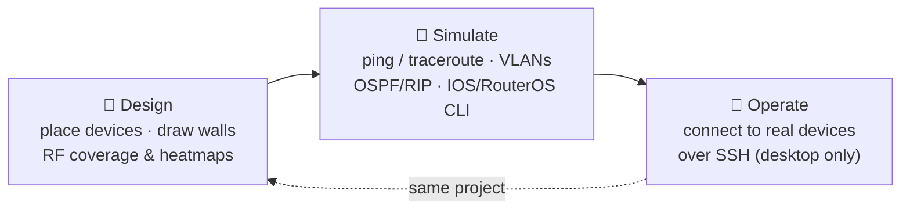
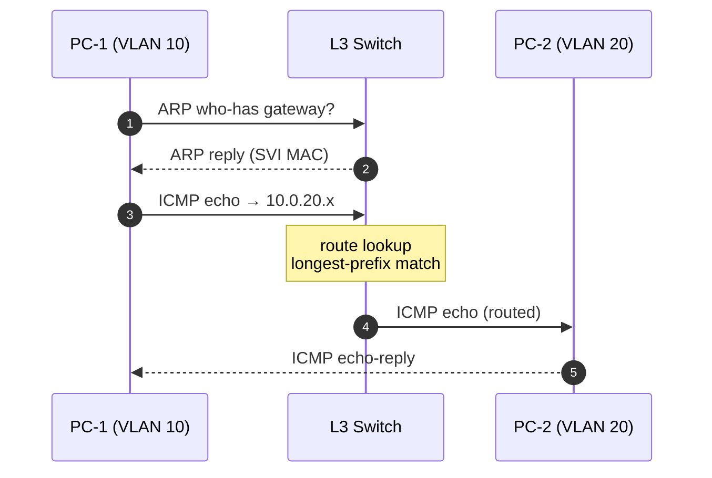
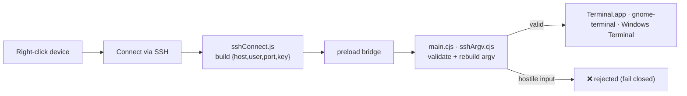
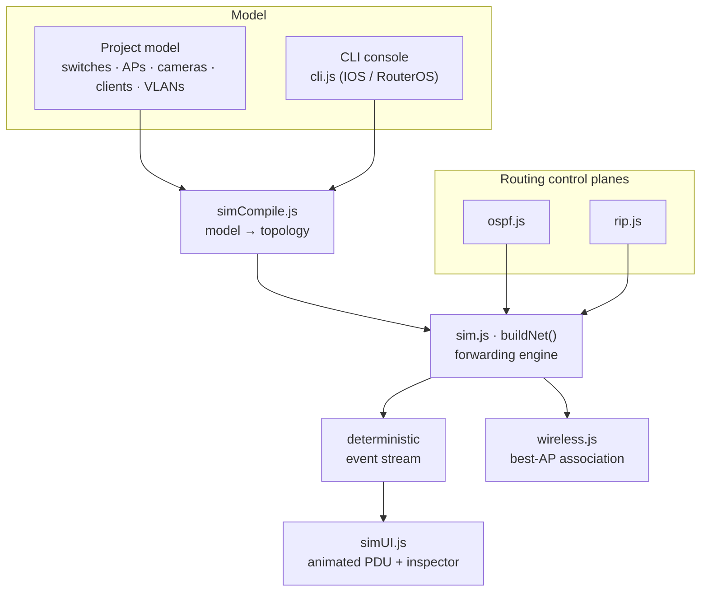

<h1 align="center">Plexus</h1>
<p align="center"><em>Plan it. Simulate it. Operate it.</em><br/>
Predictive WiFi &amp; camera design · a Packet-Tracer-class network simulator · live device operation — one app, no backend.</p>

<p align="center">
<a href="https://github.com/SP1R4/plexus-network-planner/releases/latest"></a>
<a href="https://github.com/SP1R4/plexus-network-planner/actions/workflows/ci.yml"></a>


<a href="LICENSE"></a>

</p>

<p align="center"><strong><a href="https://sp1r4.github.io/plexus-network-planner/">▶ Try it in your browser</a></strong> — nothing to install; click <em>Load sample project</em>.</p>

<p align="center"></p>

---

## Table of contents

1. [What is Plexus?](#what-is-plexus)
2. [The three modes](#the-three-modes)
3. [Install](#install)
4. [Tutorial 1 — Design a WiFi plan](#tutorial-1--design-a-wifi-plan)
5. [Tutorial 2 — Simulate the network](#tutorial-2--simulate-the-network)
6. [Tutorial 3 — Operate: connect to a real device](#tutorial-3--operate-connect-to-a-real-device)
7. [Feature reference](#feature-reference)
8. [Keyboard shortcuts](#keyboard-shortcuts)
9. [How it works (architecture)](#how-it-works-architecture)
10. [The coverage math](#the-coverage-math)
11. [Build &amp; desktop installers](#build--desktop-installers)
12. [Tests](#tests)
13. [Project layout](#project-layout)
14. [Project file format](#project-file-format)
15. [Roadmap · Contributing · Security · License](#roadmap)

---

## What is Plexus?

Plexus is a **network site planner, simulator and operator** in a single app that
runs in any browser or as a native desktop build. You design a network on a floor
plan, turn that same design into a **working simulated network** you can `ping`
and configure over a Cisco/MikroTik CLI, and then **connect to the real gear** over
SSH — all from the same canvas. No backend, no accounts; a project is one JSON file
you can email.

> **[Live demo](https://sp1r4.github.io/plexus-network-planner/)** (deployed from
> `main`) · **[Download the latest release](https://github.com/SP1R4/plexus-network-planner/releases/latest)**
> for macOS `.dmg`, Windows `.exe`, Linux `.AppImage`/`.deb`, or the portable
> browser zip · **[Changelog](CHANGELOG.md)**

---

## The three modes

Plexus has one canvas and three workspace **modes**. The top-bar switcher changes
which tools are available, so each mode stays focused.



| Mode | What you do | Key |
|------|-------------|-----|
| **Design** | Lay out APs, cameras, switches/routers, walls; read wall-aware coverage + heatmaps. | `A` |
| **Simulate** | Run packets on your design: VLANs, routing, DHCP/DNS/NAT, a per-device CLI. | `M` |
| **Operate** | Open an SSH session to the real device you clicked. Desktop build only, behind a confirmation. | — |

---

## Install

### Option A — browser (zero install)

Open the **[live demo](https://sp1r4.github.io/plexus-network-planner/)**, or grab
the **portable zip** from [Releases](https://github.com/SP1R4/plexus-network-planner/releases/latest),
unzip, and open `index.html`. Fully offline, runs from `file://`.

> The browser build does everything *except* the desktop-only features (Operate /
> SSH, live WiFi survey, UniFi sync) — those need the native app.

### Option B — desktop app (recommended)

Download the installer for your OS from
[Releases](https://github.com/SP1R4/plexus-network-planner/releases/latest):

| OS | File | First-launch note (unsigned build) |
|----|------|-------------------------------------|
| **macOS** | `.dmg` / `.zip` | Right-click → **Open** → **Open**. If still blocked: `xattr -dr com.apple.quarantine "/Applications/Plexus.app"` |
| **Windows** | `.exe` (NSIS) | SmartScreen → **More info** → **Run anyway** |
| **Linux** | `.AppImage` / `.deb` | `chmod +x *.AppImage` then run |

### Option C — from source

```bash
git clone https://github.com/SP1R4/plexus-network-planner
cd plexus-network-planner
npm install
npm run dev          # browser dev server → http://localhost:5173
npm run app:dev      # OR launch the desktop app
```

Requires **Node 18+** (LTS recommended).

---

## Tutorial 1 — Design a WiFi plan

> Goal: a floor plan with wall-aware coverage and a signal heatmap.

1. **Load a plan.** Click **▶ Load sample project** to start populated, or
   **↑ Upload Map** and drop a floor plan (PNG / JPG / SVG / PDF).
2. **Set the scale.** In the toolbar, set **SCALE** = metres per 100 px of the
   image. This switches the heatmap to physical, FSPL-based path loss.
3. **Draw walls.** Press <kbd>L</kbd> and drag (hold <kbd>Shift</kbd> to snap to
   45°). Pick a material — drywall, glass, brick, concrete — each attenuates
   differently. Or **import** walls from an SVG/DXF, or auto-detect them from the
   bitmap.
4. **Place access points.** Press <kbd>A</kbd> and click. Each AP renders its
   **actual wall-clipped coverage polygon**, not a circle.
5. **Turn on the heatmap.** Open **▤ Layers ▾ → Heatmap**, then cycle the metric
   pill through **RSSI → SNR → SINR → MCS → Throughput**.
6. **Optimize.** Use **✦ Auto-place** (drop APs to hit 92% coverage), **⌁ Auto-channel**
   (graph-colouring), and **⌁ Auto-power**.
7. **Deliver.** Export a branded **PDF**, **BoM/cable-schedule CSV**, or a
   one-zip **Handover pack**.

| | |
|---|---|
|  |  |
| **Coverage polygons** — wall-clipped, with camera FoV cones | **Heatmap** — RSSI (ITU-R P.1238 indoor model) |

<details>
<summary>📸 More screenshots — throughput heatmap, dark mode, cable runs</summary>

| | |
|---|---|
|  |  |
| Estimated-throughput heatmap | Dark mode |


*All shots come from the bundled sample (`files/src/sampleProject.js`), regenerated with `node scripts/capture-media.mjs`.*

</details>

---

## Tutorial 2 — Simulate the network

> Goal: make the design forward real packets, route between VLANs, and take CLI config.

Switch to **🧪 Simulate** (press <kbd>M</kbd>). The packet-sim panel opens.

**Ping across the topology**

1. Pick a **source** and **destination** device.
2. Click **Ping** — an animated PDU walks the map hop by hop; the step inspector
   shows each decision (ARP → L2 forward → L3 route → deliver).



**Configure a device from the CLI**

Select a switch/router → **CLI Console**. Type real **Cisco IOS** or **MikroTik
RouterOS**; the simulator forwards accordingly.

```text
# Cisco IOS — inter-VLAN routing on an SVI
interface vlan 20
 ip address 10.0.20.1 255.255.255.0
 no shutdown
!
router ospf 1
 network 10.0.0.0 0.0.255.255 area 0
```

```text
# MikroTik RouterOS — the equivalent
/ip address add address=10.0.20.1/24 interface=vlan20
/routing ospf instance add name=default
/routing ospf network add network=10.0.0.0/16 area=backbone
```

What the simulator models: **L2 switching + VLANs + MAC learning**, **ARP**,
**L3 routing** (connected/static + **OSPF** and **RIP**), **DHCP**, name-based
**DNS** (`ping AP-01` resolves), **NAT/PAT**, **ACL/firewall**, an **internet
cloud**, and **link-down fault injection**. Drop a **wireless client** (<kbd>K</kbd>)
and it associates to the best AP *by real signal*, then gets a DHCP lease.

> The RouterOS dialect is validated against real hardware (hAP ax lite,
> RouterOS 7.24.4).

---

## Tutorial 3 — Operate: connect to a real device

> Goal: SSH into the physical device you clicked. **Desktop app only.**

1. **Give the device credentials.** Select it → **Credentials**: set **Protocol** =
   SSH, **Host** (defaults to the device IP), **Port**, **Username**, and an
   optional **SSH key** path (e.g. `~/.ssh/id_ed25519`). A **🔑** badge marks
   devices that are SSH-connectable.
2. **Protect the file.** In **Settings → Credentials passphrase**, set a passphrase
   so credentials are encrypted at rest — a shared `.plexus` never leaks a password.
   (Entering Operate reminds you if plaintext passwords are present.)
3. **Connect.** Switch to **🔌 Operate** (confirm the prompt), then **right-click the
   device → Connect via SSH**. Your OS terminal opens a live session.



**Security model.** The renderer only ever sends **structured fields** —
the main process re-validates them and rebuilds the `ssh` command itself, so a
hostile project file can't inject a shell command. **No password is ever put on
the command line** (key/agent auth, or ssh prompts in the terminal). The command
run is exactly:

```bash
ssh -i ~/.ssh/your_key -p 22 admin@192.0.2.10
```

> If a device connects as your local username instead of the one you expect, its
> **Username** field is empty — `ssh` falls back to your OS login. Set it.

---

## Feature reference

<details open>
<summary><strong>Coverage modelling</strong></summary>

- **Wall-aware coverage** — per-material dB attenuation (drywall/wood/glass/brick/
  concrete) summed along 72 cast rays per AP → the real reachable polygon.
- **Band-aware** 2.4 / 5 / 6 GHz wall-loss multipliers; **directional antennas**
  (omni, ceiling, wall, sector 90/60/30°).
- **Real heatmap** (Web Worker) — RSSI / SNR / **SINR** / MCS / throughput, band-filtered.
- **Channel widths** 20–320 MHz (noise-floor + OFDMA-accurate); **airtime/capacity** checks.
- **Propagation models** — log-distance, ITU-R P.1238, COST-231 multi-wall.
- **Regulatory regions** (FCC/ETSI/JP/AU-NZ/IN/BR), **roaming overlap**,
  **floor-to-floor leakage**, **auto channel/power/placement**.
</details>

<details>
<summary><strong>Network simulation (Packet-Tracer-class)</strong></summary>

- Deterministic forwarding engine: **L2/VLAN/MAC**, **ARP**, **L3 routing**
  (longest-prefix, TTL), **ICMP ping/traceroute**, **L4 probe**.
- **Inter-VLAN routing** (L3 switch / SVIs / routed `/30` uplinks).
- **Dynamic routing** — **OSPF** (Dijkstra) and **RIP** (15-hop).
- **Services** — DHCP, name-based DNS, NAT/PAT, ACL/firewall, internet cloud.
- **Device CLI** — Cisco IOS + MikroTik RouterOS, running/startup config, `show` cmds.
- **Animated PDU** on the map + step inspector; **wireless association** via real RF;
  **fault injection**.
</details>

<details>
<summary><strong>Live operation (desktop)</strong></summary>

- **Right-click → Connect via SSH** (macOS/Linux/Windows terminal).
- **Per-device credentials** + optional SSH key; **encrypted credentials vault**.
- **Fail-closed** ssh-argv validation; **no password on argv**.
- **UniFi controller sync** (pull as-built / push channel-power); **live WiFi survey**.
</details>

<details>
<summary><strong>Devices · planning · organization · deliverables</strong></summary>

- **Devices** — AP/camera/switch catalogs (UniFi, MikroTik, Cisco, Aruba, Meraki,
  Hikvision, Dahua, Axis…), L2/L3 switches, wireless clients, walls, dead zones,
  SVG/DXF import, CV wall detection, DORI zones, NVR storage calculator.
- **Planning** — PoE budgets, cable runs, topology tree, survey CSV import, Ekahau
  `.esx` interop, AP-on-stick.
- **Organization** — inventory & rollout table, IPAM + VLAN registry, port maps,
  naming convention, as-designed-vs-as-built diff, handover pack.
- **Deliverables** — branded PDF, BoM + cable-schedule CSV, per-AP install sheets,
  design-review comments, annotations.
</details>

---

## Keyboard shortcuts

| Key | Tool | Key | Tool |
|-----|------|-----|------|
| <kbd>A</kbd> | Add AP | <kbd>M</kbd> | Packet simulation |
| <kbd>W</kbd> | Switch / Router | <kbd>K</kbd> | Wireless client |
| <kbd>C</kbd> | Camera | <kbd>L</kbd> | Wall |
| <kbd>D</kbd> | Dead zone | <kbd>N</kbd> | Annotation |
| <kbd>R</kbd> | Ruler | <kbd>V</kbd> | Toggle coverage |
| <kbd>H</kbd> | Toggle heatmap | <kbd>O</kbd> | Toggle overlaps |
| <kbd>G</kbd> | Toggle grid | <kbd>?</kbd> | Full cheatsheet |

---

## How it works (architecture)

The project model is **compiled** into a topology that a pure, headless engine
forwards packets over; the UI is a thin renderer, and the CLI folds back into the
same compile step so typed config changes what the next `ping` does.



Everything under `files/src/` is **pure and DOM-free**, type-checked with
`tsc --checkJs` (JSDoc, no `.ts` rename), and has a sibling test in `tests/`.

---

## The coverage math

**Coverage polygons** — for each AP we cast **72 rays** (every 5°). Each ray sums
per-material dB loss × the AP's **band factor** (0.6 / 1.0 / 1.3 for 2.4 / 5 / 6 GHz)
and shrinks its reach by `0.5^(loss/3)` — every 3 dB of attenuation roughly halves
range. The 72 endpoints form the cached coverage polygon.

**Heatmap dBm** — with a real-world **SCALE** set, signal uses physical path loss:

```
RSSI(d) = EIRP − FSPL(1m) − 10·n·log₁₀(d) − Σ wall_dB
FSPL(1m) = 20·log₁₀(f_MHz) − 27.55        f = 2437 / 5500 / 6525 MHz
n        = 2.2 (log-distance) · 3.0 (ITU indoor) · 2.0 (COST-231 + per-wall)
EIRP     = Tx power + antenna gain − cable loss
```

See `files/src/geometry.js` (pure, unit-tested) and
[docs/accuracy.md](docs/accuracy.md) for predicted-vs-measured.

---

## Build & desktop installers

```bash
npm run build        # → dist/  (open dist/index.html directly; file:// safe)
npm run app:build    # → release/  (installer for the OS you're on)
```

`base: './'` keeps the web build portable across `http://`, a CDN, or `file://`.
`app:build` only makes the **current** platform's installer; the GitHub Actions
matrix (`.github/workflows/release.yml`) builds **all three** on a `v*` tag — one
native runner per OS. App icons live in `electron/resources/`
(`npm run make:icons`, macOS only).

---

## Tests

```bash
npm run verify       # the full gate: vitest + tsc
npm run e2e:install  # one-time: fetch the Playwright browser
npm run e2e          # Playwright end-to-end suite
```

**467 unit tests across 30 files** — RF geometry (incl. the physical FSPL model),
the forwarding engine (L2/L3, VLANs, ARP, routing, ACL, NAT, DHCP, DNS), **OSPF**
and **RIP** convergence, the IOS/RouterOS CLI engine, the project→sim adapter
(hardened against malformed/hostile project data), schema migration, crypto, the
**SSH argv validator** (injection-rejection cases), and the bundled sample project.
Plus a **9-test Playwright E2E** suite (boot smoke + full scenario: load → place →
wall → coverage re-clips → export → re-import, and the inventory/rollout/handover flow).

---

## Project layout

```
files/
  index.html            UI shell
  app.js                App orchestrator (state, DOM, events, modes)
  styles.css            Theming + component styles
  src/
    geometry.js         Pure RF math (ray-cast, dBm, SNR, MCS, propagation)
    heatmap.js / heatmapWorker.js   Heatmap model + Web Worker
    network.js          IP / subnet / CIDR + IPAM helpers
    sim.js              Forwarding engine (L2/L3, ARP, routing, ACL, NAT, cloud)
    ospf.js / rip.js    Dynamic-routing control planes
    dns.js              Name-resolution zone
    cli.js / cliUI.js   IOS/RouterOS config engine + per-device console
    simCompile.js       Project model → engine topology
    simUI.js            Packet-sim panel + animated PDU
    wireless.js         RF → best-AP association bridge
    sshConnect.js       Device → ssh target/command (renderer)
    sshConfig.js        ~/.ssh/config parse + device matching
    constants.js        AP / camera / switch catalogs, patterns, PoE, regions
    migrate.js          Schema migrations (v1 → v11)
    imageStore.js / sampleProject.js / cameras.js / naming.js /
    dxf.js / esx.js / walldetect.js / zip.js / i18n.js / i18n/en.js
electron/
  main.cjs              Windows, UniFi sync, WiFi survey, SSH launch
  preload.cjs           contextIsolated bridge (window.plexusNative)
  sshArgv.cjs           Validated ssh-argv builder (shell-injection boundary)
tests/                  30 vitest suites + e2e/ (Playwright smoke + scenario)
.github/workflows/      ci.yml (verify) · release.yml (installer matrix on v* tags)
vite.config.js  vitest.config.js  playwright.config.js  tsconfig.json
```

---

## Project file format

Projects save as a single JSON file; floor-plan images live in IndexedDB,
referenced by id. Schema is versioned and the migrator reads every prior version —
current schema is **v11** (`files/src/migrate.js`). Device credentials are stored in
the file only, excluded from Share links and reports, and encrypted when a project
passphrase is set.

---

## Roadmap

- EIGRP and IPv6 in the simulator (today: static + OSPF + RIP, IPv4)
- Embedded SSH console in Operate mode (today: launches the OS terminal)
- Plan ↔ device **drift detection** (pull live config, diff against the model)
- Ekahau / NetSpot survey-file import (today: CSV only)
- Additional UI language bundles (English ships today)

## Contributing

PRs welcome — see [CONTRIBUTING.md](CONTRIBUTING.md). Anything touching geometry,
the forwarding engine, the CLI, or schema versions needs a test in `tests/`.

## Security

See [SECURITY.md](SECURITY.md) to report something privately. Credentials are never
logged in plaintext; the SSH launcher validates all input and fails closed.

## License

[MIT](LICENSE) — do whatever you want, just don't blame me when your boss asks why
the coverage map said the conference room had signal.
